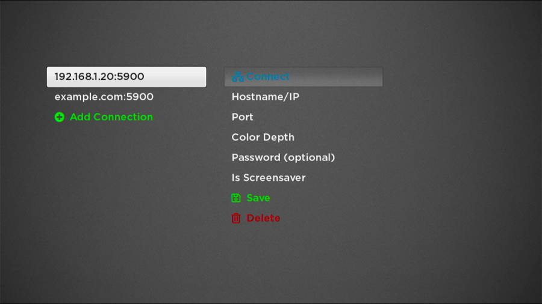

# Vince - VNC client for Roku OS (GPLv3+)

Vince is a basic view-only VNC client for Roku. It supports storing several connections and selecting them from a menu.

* Color depths of 8 or 24 bpp are supported
* VNC password authentication
* One connection can be selected as a screensaver. If the system screensaver is set to the Vince channel, that connection will be opened when the screensaver starts.

## Building

Currently the build relies on a Roku-provided Makefile with no explicit license. See the comment at the bottom of `Makefile` for the URL to that file, download it, and run `make` to build the zip, then [sideload it](https://developer.roku.com/en-ca/docs/developer-program/getting-started/developer-setup.md).

## License

Vince is free software: you can redistribute it and/or modify it under the terms of the GNU General Public License as published by the Free Software Foundation, either version 3 of the License, or (at your option) any later version.

The full text of the license is included in the file "COPYING". See also LICENSE.md.
